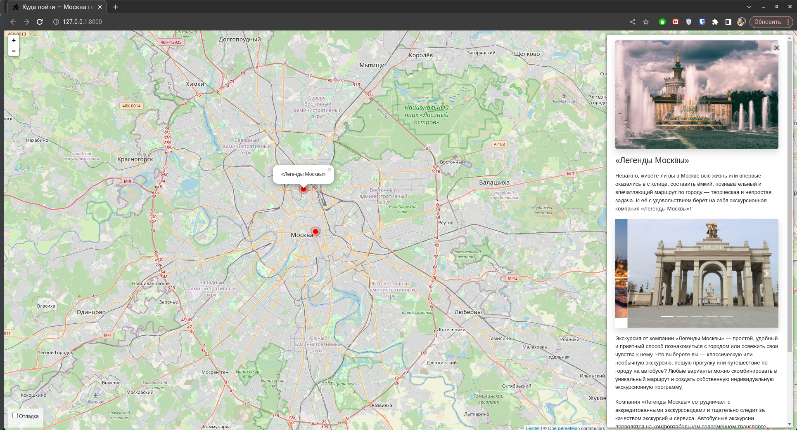
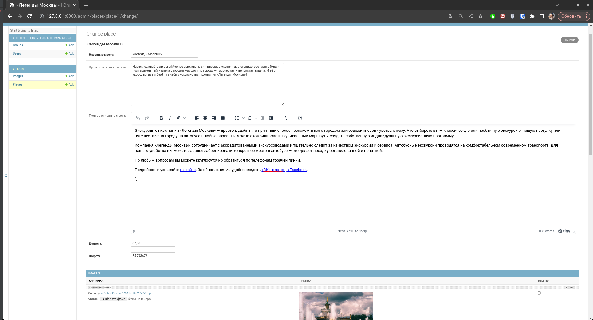

# Where_to_go - места для посещений, Москва глазами Артёма

Интерактивная карта Москвы, на которой Артем отметил замечательные места для своих читателей. 



## Демо-версия сайта

Ссылка для перехода на сайт: **[Where to go site]()**

## Запуск

Для запуска сайта вам понадобится Python третьей версии.
Скачайте код с GitHub. Установите зависимости:

```sh
pip install -r requirements.txt
```

Создайте базу данных SQLite

```sh
python3 manage.py migrate
```

Запустите сервер

```
python3 manage.py runserver
```

## Переменные окружения

Часть настроек проекта берётся из переменных окружения. Чтобы их определить, создайте файл `.env` рядом с `manage.py` и запишите туда данные в таком формате: `ПЕРЕМЕННАЯ=значение`.

Доступны 3 переменные:
- `DEBUG` — дебаг-режим. Поставьте `True`, чтобы увидеть отладочную информацию в случае ошибки.
- `SECRET_KEY` — секретный ключ проекта
- `ALLOWED_HOSTS` — смотри [документацию Django](https://docs.djangoproject.com/en/3.1/ref/settings/#allowed-hosts)


## Администрирование

Для удобного управления сайтом необходимо перейти на панель администратора:



Можно добавить, исправить или удалить следующую информацию о локации:

* **Название места** (обязательно поле)
* **Краткое описание места**
* **Полное описание места**
* **Долгота** (обязательно поле)
* **Широта** (обязательно поле)
* **Картинки**

## Цели проекта

Тестовые данные взяты с сайта KudaGo.

Код написан в учебных целях.