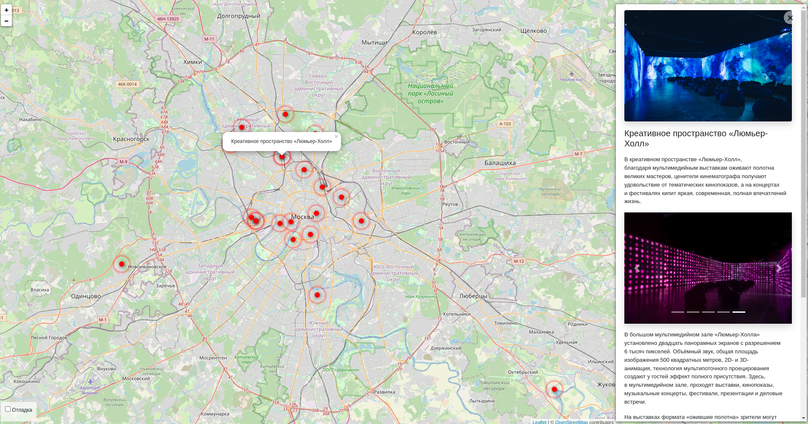

# Where_to_go - места для посещений, Москва глазами Артёма

Интерактивная карта Москвы, на которой Артем отметил замечательные места для своих читателей. 



## Демо-версия сайта

Ссылка для перехода на сайт: **[Where to go site](http://elmirazaych.pythonanywhere.com/)**

## Запуск

Для запуска сайта вам понадобится Python третьей версии.
Скачайте код с GitHub. Установите зависимости:

```sh
pip install -r requirements.txt
```

Создайте базу данных SQLite

```sh
python3 manage.py migrate
```

Запустите сервер

```
python3 manage.py runserver
```

## Переменные окружения

Часть настроек проекта берётся из переменных окружения. Чтобы их определить, создайте файл `.env` рядом с `manage.py` и запишите туда данные в таком формате: `ПЕРЕМЕННАЯ=значение`.

Доступны 3 переменные:
- `DEBUG` — дебаг-режим. Поставьте `True`, чтобы увидеть отладочную информацию в случае ошибки.
- `SECRET_KEY` — секретный ключ проекта
- `ALLOWED_HOSTS` — смотри [документацию Django](https://docs.djangoproject.com/en/3.1/ref/settings/#allowed-hosts)


## Администрирование

Для удобного управления сайтом необходимо перейти на панель администратора:


Можно добавить, исправить или удалить следующую информацию о локации:

* **Название места** (обязательно поле)
* **Краткое описание места**
* **Полное описание места**
* **Долгота** (обязательно поле)
* **Широта** (обязательно поле)
* **Картинки**

Для загрузки данные из JSON файла можно воспользоваться командой для терминала:

Вам понадобится ссылка на json-файл следующей структуры:
```commandline
{
    "title": "Источник Преподобного Сергия Радонежского",
    "imgs": [
        "https://raw.githubusercontent.com/devmanorg/where-to-go-places/master/media/01cc9185977dfbc92482a5e7fc9fa6ab.jpg",
        "https://raw.githubusercontent.com/devmanorg/where-to-go-places/master/media/6959e16871f92f4a121900a35d0e38f9.jpg",
        "https://raw.githubusercontent.com/devmanorg/where-to-go-places/master/media/5842a474aea8d40d3a0893c6201e483b.jpg",
        "https://raw.githubusercontent.com/devmanorg/where-to-go-places/master/media/445a1126a848959debd728691736d9ef.jpg",
        "https://raw.githubusercontent.com/devmanorg/where-to-go-places/master/media/50716418c15585095ccf25783ca8eda1.jpg",
        "https://raw.githubusercontent.com/devmanorg/where-to-go-places/master/media/9101acf25cd2568a355ce2176e6e83c3.jpg",
        "https://raw.githubusercontent.com/devmanorg/where-to-go-places/master/media/105a1c3543790f80d060d73472073cfc.jpg",
        "https://raw.githubusercontent.com/devmanorg/where-to-go-places/master/media/299dfbd9b1bf4d8709e78a8d21ba960c.jpg",
        "https://raw.githubusercontent.com/devmanorg/where-to-go-places/master/media/04a4cd8136c833b26a91d3585261e5f2.jpg",
        "https://raw.githubusercontent.com/devmanorg/where-to-go-places/master/media/ca069440b3a5f542e0a89b5ec6c5762d.jpg",
        "https://raw.githubusercontent.com/devmanorg/where-to-go-places/master/media/139d332d7ba64dcdd4491b0424beb1a8.jpg",
        "https://raw.githubusercontent.com/devmanorg/where-to-go-places/master/media/e426190561eeacf5ec831a47bc87ab93.jpg"
    ],
    "description_short": "Для православных паломников Гремячий ключ — свидетельство чудотворной силы одного из самых чтимых на Руси святых. Для светских туристов и любителей природы — изменчивая в своём облике и характере достопримечательность Подмосковья, источник неизменно чистой воды. А вокруг — плоды труда, вдохновлённого верой.",
    "description_long": "<p>В православной паломнической традиции это место известно ещё и как Святогорье. Однако обычно в ходу его светское название — Гремячий ключ. Ещё его принято называть водопадом, что оказывается то верно, то неверно в зависимости от текущего геологического состояния. За каждое столетие склон здешней горы в окрестностях деревни Взгляднево сползает и обваливается приблизительно на метр. Соответственно, источник, который берёт начало в подземном озере, то низвергается с горы, принимая форму водопада, а то стекает ручьём или несколькими ручьями.</p><p>В середине XIV столетия, согласно преданию, здесь остановились Старец Сергий с учеником, впоследствии святым Романом Киржачским, по пути из Троицкого монастыря к речке Киржач. По просьбе Романа, которому очень хотелось пить, после молитвы Сергия и удара посохом из склона горы забил источник. Его воде приписывают способность исцелять верующих. В советские времена эта (уже туристическая и тогда вполне светская) достопримечательность носила неофициальное название «Источник в Малинниках».</p><p>С 1990-х годов православные энтузиасты непрестанно благоустраивают прилегающую территорию, поддерживая её как место паломничества. В наши дни богомольцы и туристы найдут здесь церковь Сорока севастийских мучеников, деревянные мостки, место для набора воды, купальни, лестницу, колокольню. На ухоженном участке располагаются надвратный храм, трапезная, сад и питомник, продаются сувениры. Здесь празднуют православные праздники, устраивают экскурсии и организовывают поездки,</p>",
    "coordinates": {
        "lng": "38.3428859657379",
        "lat": "56.27004883072055"
    }
}
```

Пример команды:

```commandline
python manage.py load_place https://github.com/devmanorg/where-to-go-places/blob/master/places/%D0%98%D1%81%D1%82%D0%BE%D1%87%D0%BD%D0%B8%D0%BA%20%D0%9F%D1%80%D0%B5%D0%BF%D0%BE%D0%B4%D0%BE%D0%B1%D0%BD%D0%BE%D0%B3%D0%BE%20%D0%A1%D0%B5%D1%80%D0%B3%D0%B8%D1%8F%20%D0%A0%D0%B0%D0%B4%D0%BE%D0%BD%D0%B5%D0%B6%D1%81%D0%BA%D0%BE%D0%B3%D0%BE.json
```


## Цели проекта

Тестовые данные взяты с сайта KudaGo.

Код написан в учебных целях.